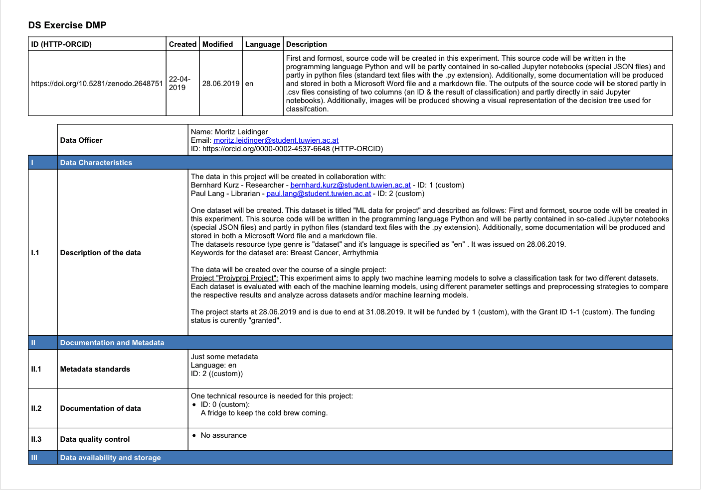

# maDMP to human readable DMP

## How it works
Our solution uses [Jinja](http://jinja.pocoo.org/docs/2.10/) templates to convert the provided JSON maDMP (via the `-d` argument) to an HTML string (styled with CSS to match the template) which is subsequently converted to PDF with the [pdfkit](https://pypi.org/project/pdfkit/) package.

The text used to make the maDMP more "human-like" is specified directly in the template, which makes tweaking and changing it quite straight-forward. The mapping of maDMP fields to the template structure can also be changed right inside of the Jinja template. This approach makes it easy for non-coders to adjust the template to their needs with very basic HTML and Jinja knowledge needed. 

## How to run
0. (Use Python 3.7)
1. Clone [repository](https://github.com/datastewardstuw/DataStewards2)
2. Run `pip install -r requirements.txt` to install required packages
3. `cd` to `src` directory
4. Run `python main.py -d path/to/dmp.json -t [FWF|HORIZON]`

The `-d` argument specifies the path of the maDMP to convert (e.g. `../dmps/DMP_ML_slim.json`), while the `-t` argument specifies the template to use, which can be either `FWF` or `HORIZON`.

## Links 
The repository containing the full code as well as this README can be found at: [https://github.com/datastewardstuw/DataStewards2](https://github.com/datastewardstuw/DataStewards2)

The original DMPs can be found in the repository as well inside the `original` directory, while the maDMP versions are located in the `dmps` directory. There are several versions of the `DMP_ML` with different levels of completeness, which were used to test the output our converter generates when fields are missing.

The generated human readable DMPS are located in the `dmps` directory as well, and are named after the JSON files they originate from, adding either `FWF` or `HORIZON` depending on which template was used, and `out` to be able to discern them from the input files (not only based on the file extension).

An example DMP generated with the FWF template is shown below:

## Comparison
